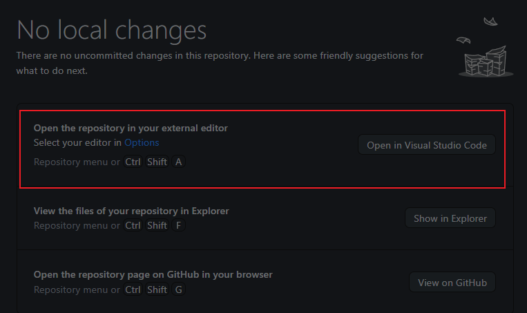
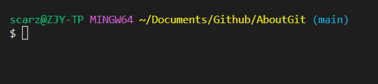
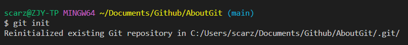
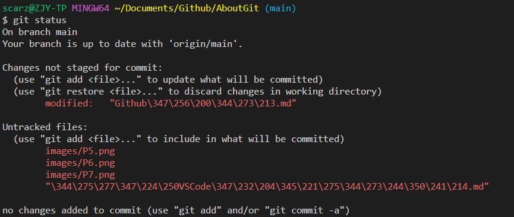
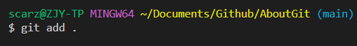
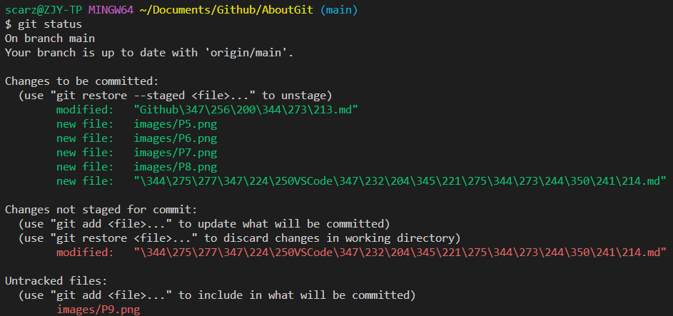
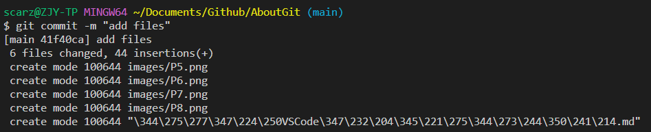
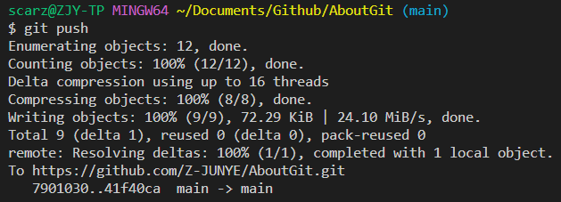

# 使用VScode管理库
可以通过GithubDesktop中的`Open in Visual Studio Code`选项在VScode中打开库。  

# VSCode命令行
使用VScode打开库之后，会自动将终端/命令行指向项目的路径。  
通过ctrl+\`可以打开VScode命令行，打开命令行后默认为shell,通过点击加号打开Git bash命令行。  

# Git指令
## 初始化项目
初始化项目需要运行

    git init

这将告诉Git准备好开始监视文件的每一个变化。

第一行是电脑的信息以及文件夹存在的路径。  
第二行是指令 `git init`  
第三行是发回的响应，表示这个库被初始化了。

## 查看文件状态
在初始化完成后，可以查看当前文件夹下的文件状态

    git status

Git会告知文件处于什么状态

该反馈可以得知，目前没有文件在`stage` `暂存`状态，处于`stage`状态的文件可以被`commit` `提交`。  
同时有三个文件处于`untracked`状态，处于`untracked`状态的文件可以被添加。 

## 添加文件
可以通过以下指令添加文件至git。 
添加所有文件

    git add .
添加某个文件

    git add "file name"

  
执行`git add .`后不会有反馈
可以通过`git status`指令再次查看文件状态：

此前提交的文件已经处于可以提交的状态。

## 提交文件
已经处于`stage`状态的文件可以通过以下命令提交：

    git commit -m "comment"

此时文件已经处于提交状态 committed state。  

## 推送库到Github
可以通过以下指令推送库：

    git push

